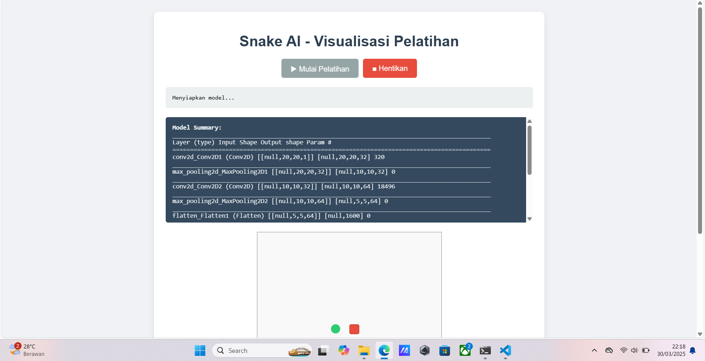

# Deep Learning AI Snake Visualization

Deep Learning AI Snake Visualization is an innovative project that leverages deep learning techniques to train an AI agent to play the classic Snake game. This project serves as both an educational tool and a demonstration of how artificial intelligence can learn and adapt to dynamic environments. The visualization highlights the AI's learning process, decision-making, and gameplay improvements over time.

## Features
- **Neural Network Integration**: The AI uses a neural network to analyze the game state and make decisions, enabling it to navigate the Snake game environment effectively.
- **Reinforcement Learning**: Implements reinforcement learning algorithms, such as Q-learning or Deep Q-Networks (DQN), to train the AI agent by rewarding positive actions and penalizing negative ones.
- **Real-Time Visualization**: Provides a dynamic, real-time display of the snake's movements, the AI's decision-making process, and the game environment.
- **Performance Metrics**: Tracks key metrics such as the AI's score, learning efficiency, and decision accuracy, offering insights into the training progress.
- **Customizable Parameters**: Allows users to experiment with different neural network architectures, learning rates, and reward functions to observe their impact on the AI's performance.
- **TensorFlow.js Integration**: Enables the project to run directly in a web browser using TensorFlow.js, making it accessible without requiring local installations.

## Use Cases

- **Educational Tool**: Ideal for students and enthusiasts to learn about deep learning, reinforcement learning, and neural networks in an interactive and engaging way.
- **AI Decision-Making Visualization**: Demonstrates how AI systems process information and make decisions in real-time.
- **Research and Experimentation**: Provides a platform for experimenting with various AI models, training algorithms, and hyperparameters to optimize performance.
- **Web-Based Accessibility**: With TensorFlow.js, users can run the project in a browser, making it platform-independent and easy to share.

## Requirements

To run the project, ensure the following dependencies are installed:
- **Python 3.x**: The programming language used for the project.
- **TensorFlow or PyTorch**: Deep learning frameworks for building and training the neural network.
- **TensorFlow.js**: For running the neural network in a web browser.
- **Pygame**: A library for creating the Snake game environment and visualizing the gameplay.
- **NumPy**: For numerical computations and data manipulation.
- **Matplotlib (optional)**: For plotting performance metrics and visualizing training progress.

## How It Works
1. **Game Environment**: The Snake game is implemented using Pygame, providing a controlled environment for the AI to interact with.
2. **Neural Network**: A neural network is designed to process the game state (e.g., snake position, food location, obstacles) and output actions (e.g., move up, down, left, or right).
3. **Reinforcement Learning**: The AI is trained using reinforcement learning, where it receives:
    - **Rewards**: For eating food and surviving longer.
    - **Penalties**: For colliding with walls or itself.
4. **Training Process**: The AI learns by trial and error, gradually improving its strategy through repeated gameplay.
5. **TensorFlow.js Integration**: The trained model can be exported and loaded into TensorFlow.js, allowing the AI to run directly in a web browser.
6. **Visualization**: The real-time visualization displays the snake's movements, the AI's decisions, and the game environment, making it easier to understand the learning process.

## Future Improvements
- **Complex Environments**: Extend the project to support more challenging game environments with additional obstacles and dynamic elements.
- **Algorithm Optimization**: Enhance the training algorithms to reduce training time and improve learning efficiency.
- **Multi-Agent Scenarios**: Introduce multiple AI agents to explore cooperative or competitive gameplay.
- **Comparative Analysis**: Integrate other AI models (e.g., genetic algorithms, rule-based systems) for side-by-side performance comparisons.
- **User Interface**: Develop a user-friendly interface for configuring training parameters and visualizing results.
- **Web-Based Enhancements**: Expand TensorFlow.js functionality to include interactive controls and browser-based performance monitoring.

## Getting Started
1. Clone the repository to your local machine.
2. Install the required dependencies using `pip install -r requirements.txt`.
3. Train the AI model using the Python-based environment.
4. Export the trained model to TensorFlow.js format.
5. Open the web-based interface to load the TensorFlow.js model and start the Snake game.
6. Observe the real-time visualization and monitor the AI's progress.

This project is a practical and engaging way to explore the fascinating world of deep learning and reinforcement learning. Whether you're a beginner or an experienced AI researcher, the Deep Learning AI Snake Visualization offers valuable insights and opportunities for experimentation.

## author
[Dwi Bakti N Dev](https://github.com/dwidevelopes)
[Facebook](https://facebook.com/royhtml)

## License
This project is licensed under the MIT License - see the [LICENSE.md](LICENSE.md) file for details